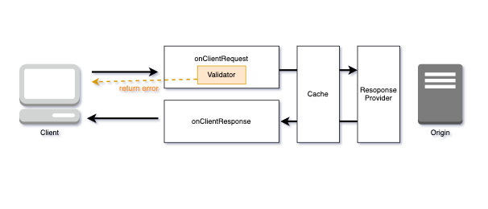
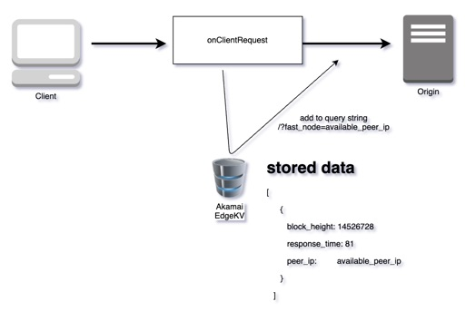

# Akamai EdgeWorker Blockchain Routing with validation

This case makes a request to reduce the load on the origin server.<br>
The code wrote in a scalable structure and can be reused.

## Challenge

It is necessary to reduce the load on the origin server at the endpoint of the distributed environment. <br>
The EdgeWorker validates and provides the best routing based on block height.


## Solution
I created a validator class,
We can use EdgeWorker to perform validation checks on URL, Header, Method, etc. <br>
It stores the state of each node in EdgeKV and connects available nodes.


## Benefit
A faster and more consistent end user experience. <br>
Reduction in cloud computing costs due to the decrease in unnecessary traffic.


## How to work


### Architecture Diagram

#### Request validator



#### Router with EdgeKV


EdgeKV does not have time-based job scheduler(like a cron job), So pushing data through another server.
The server stores the response time and block height of each node.<br>

Every minute, Find the node with fastest and highest block on the servers in each region.<br>
We store the calculated results in EdgeKV. 


```
[2021-07-19 18:41:33.256] [ 0] JPN, IPADDR: xxxx      , ResponseTime:  82ms, Avail: True, State: Vote, BlockHeight: 14565800
[2021-07-19 18:41:33.256] [ 1] KOR, IPADDR: xxxx      , ResponseTime:  83ms, Avail: True, State: Vote, BlockHeight: 14565800
[2021-07-19 18:41:33.256] [ 2] IND, IPADDR: xxxx      , ResponseTime:  84ms, Avail: True, State: Vote, BlockHeight: 14565800
[2021-07-19 18:41:33.256] [ 3] USA, IPADDR: xxxx      , ResponseTime: 453ms, Avail: True, State: Vote, BlockHeight: 14565800
[2021-07-19 18:41:33.256] [ 4] SGP, IPADDR: xxxx      , ResponseTime: 456ms, Avail: True, State: Vote, BlockHeight: 14565800
                                        .
                                        .
                                        .
                                                
[2021-07-19 18:41:33.257] [50] DE, IPADDR: xxxxxx    , ResponseTime: 546ms, Avail: True, State: Vote, BlockHeight: 14565499

```


It's stored in the following structure.
```json
   [
      {
         "block_height": 14527957,
         "response_time": 82,
         "peer_ip":         "fast_peer_ip",
      },
      {
        "block_height": 14527912,
        "response_time": 100,
        "peer_ip":         "slow_peer_ip",
      }
      
  ]
```
Block height value is very important in blockchain.

### Set a Validation rules


Define and validate essential values ​​as objects.
EdgeWorker returns an error if the values defined by the required values are different.

`onClientRequest` - Event handler function 
* This event happens for every request as the request is received, before checking if a response is available in cache. Use this event for request modifications before going to cache or to origin. Here’s an example of a function that modifies the response based on user location:
* https://learn.akamai.com/en-us/webhelp/edgeworkers/edgeworkers-user-guide/GUID-65ED3146-E158-4443-B591-35E0D3B58DA2.html

`Request` - Object
* The request object represents the HTTP request. It contains properties that provide details and context about the request, as well as properties that allow for modifying the request.
* https://learn.akamai.com/en-us/webhelp/edgeworkers/edgeworkers-user-guide/GUID-8BB264F4-2D50-4CBA-B297-61A87189ADE6.html?hl=onclientrequest
* Properties for the Request Object
    * `method`, `scheme`, `host`, `path`, `query`, `url`, `cpCode`, `userLocation`, `device`, `cacheKey`, `getHeader`, `getVariable` 

`CheckValidRequest` - Class

```javascript

export  function onClientRequest(request) {
  const validate_rules = [
    {
      "match": {
        "url": "/api/v3",    // match with multiple criteria
      },
      "required": {
        "method": "POST",
        "getHeader": {"Content-type": "application/json"}
      }
    },{
      "match": {
        "url": "/api/v1",
      },
      "required": {
        "method": "GET",
        "getHeader": {
          "MUST_HAVE": "true",
          "Content-type": "application/json"
        }
      }
    },{
      "match": {
        "url": "/api/v3/debug",
      },
      "required": {
        "method": "GET",
        "getHeader": {
          "MUST_HAVE": "true"
        },
        "userLocation": {
          "country": ["JP", "US", "KR"]
        }
      }
    },
  ];

  new CheckValidRequest(validate_rules, request).check();

}

```


## Tests


Test using httpie(https://httpie.io/)

#### Invalid Request

```bash
🌈$ http get https://ewcc02.ewcc.in/api/v3
GET /api/v3 HTTP/1.1
Accept: */*
Accept-Encoding: gzip, deflate
Connection: keep-alive
Host: ewcc02.ewcc.in:9550
User-Agent: HTTPie/2.4.0


HTTP/1.1 400 Bad Request
Cache-Control: max-age=0, no-cache, no-store
Connection: keep-alive
Content-Length: 238
Content-Type: text/html
Date: Fri, 18 Jun 2021 05:55:34 GMT
Expires: Fri, 18 Jun 2021 05:55:34 GMT
Pragma: no-cache
X-Akamai-Sandbox: true
X-Akamai-Staging: ESSL

{
    "error": [
        "Invalid method: 'GET', required 'POST'",
        "Invalid getHeader 'Content-type': 'undefined', required 'application/json'",
        "Invalid Content-length: 'undefined', required bigger than '11'"
    ],
    "match": [
        "Matched rule 'url' => '/api/v3'"
    ]
}


```


#### Valid Request

```bash
🌈$ http post https://ewcc02.ewcc.in/api/v3 Content-type:application/json jsonrpc=2.0 method=icx_getLastBlock params:='{}' id=2848
POST /api/v3 HTTP/1.1
Accept: application/json, */*;q=0.5
Accept-Encoding: gzip, deflate
Connection: keep-alive
Content-Length: 76
Content-type: application/json
Host: ewcc02.ewcc.in:9550
User-Agent: HTTPie/2.4.0

{
    "id": "2848",
    "jsonrpc": "2.0",
    "method": "icx_getLastBlock",
    "params": {}
}


HTTP/1.1 200 OK
Access-Control-Allow-Origin: *
Cache-Control: max-age=0, no-cache, no-store
Connection: keep-alive
Content-Encoding: gzip
Content-Length: 841
Content-Type: application/json
Date: Fri, 18 Jun 2021 06:00:07 GMT
Expires: Fri, 18 Jun 2021 06:00:07 GMT
Pragma: no-cache
Vary: Accept-Encoding
X-Akamai-Sandbox: true
X-Akamai-Staging: ESSL
X-Cached: EXPIRED

{
    "id": "2848",
    "jsonrpc": "2.0",
    "result": {
        "block_hash": "abf1ff92ebf38e4a6def7ca0fd66774306e2cd394e950946c47a8f2e8cc7a207",
        "confirmed_transaction_list": [
            {
                "data": {
                    "prep": {
                        "irep": "0xa968163f0a57b400000",
                        "rrep": "0x350",
                        "totalDelegation": "0x60442447bbf6781e3ec772",
                        "value": "0x3b1454445ff01b67"
                    },
                    "result": {
                        "coveredByFee": "0x0",
                        "coveredByOverIssuedICX": "0x0",
                        "issue": "0x3b1454445ff01b67"
                    }
                },
                "dataType": "base",
                "timestamp": "0x5c50408ea6a43",
                "txHash": "0x2d04d61dfa225adf592103646112331eed3bcc30e0b42e15abc9476883e3cfee",
                "version": "0x3"
            },
            {
                "from": "hx5a05b58a25a1e5ea0f1d5715e1f655dffc1fb30a",
                "nid": "0x50",
                "signature": "OM/8/lyDkvFGFIeUA7fWPf90Xfrgk8j7JHI+lXjCHnkQfuPZPF4XOpgZH32zwtyJicse6U4xX19DOP67nqmr8gE=",
                "stepLimit": "0x1e8480",
                "timestamp": "0x5c50408d67be2",
                "to": "hx0000000000000000000000000000000000000000",
                "txHash": "0xcf12f93875ee6cba028099059e31297bbf42fbefc293c287b10508f06df9590b",
                "value": "0x38d7ea4c68000",
                "version": "0x3"
            }
        ],
        "height": 13228138,
        "merkle_tree_root_hash": "4b27565eeb23529565fa9991484abfcfbd5ebbf650021c23839502a7119f4741",
        "next_leader": "hxfa9a8824a114224c508d50f720f965cc673243e4",
        "peer_id": "hxfa9a8824a114224c508d50f720f965cc673243e4",
        "prev_block_hash": "b9ae9cd2ac75d5cd09cf0f08ba20af8b3a8d95b91afa1c34a9f5bb99c65f8070",
        "signature": "3Qa/o6MN2oX94tWqWvTyzHRQyOJ4xc7YiZr+6V5PXkA3DV2J2BQBqSf5Q7XWhN4Ejo2ujw1vPhYzbAgWviWl5wA=",
        "time_stamp": 1623996003674691,
        "version": "0.5"
    }
}

```

```
✘ 🌈 akamai-ew-validator   master ± http post https://ewcc02.ewcc.in/api/v3 Content-type:application/json  id=2848 jsonrpc=2.0 method=icx_getTotalSupply -- `cat header`
POST /api/v3 HTTP/1.1
Accept: application/json
Accept-Encoding: gzip, deflate
Akamai-EW-Trace: st=1626611682~exp=1626615282~acl=/*~hmac=xxxx
Connection: keep-alive
Content-Length: 64
Content-type: application/json
Host: ewcc02.ewcc.in
Pragma: akamai-x-ew-debug,akamai-x-ew-debug-subs,akamai-x-cache-on,akamai-x-cache-remote-on,akamai-x-check-cacheable,akamai-x-get-cache-key,akamai-x-get-true-cache-key,akamai-x-get-extracted-values,akamai-x-get-ssl-client-session-id,akamai-x-serial-no,akamai-x-get-request-id
User-Agent: HTTPie/2.4.0

{
    "id": "2848",
    "jsonrpc": "2.0",
    "method": "icx_getTotalSupply"
}


HTTP/1.1 200 OK
Access-Control-Allow-Origin: *
Cache-Control: max-age=0, no-cache, no-store
Connection: keep-alive
Content-Encoding: gzip
Content-Length: 84
Content-Type: application/json
Date: Sun, 18 Jul 2021 13:24:39 GMT
Expires: Sun, 18 Jul 2021 13:24:39 GMT
Pragma: no-cache
Vary: Accept-Encoding
Vary: Accept-Encoding
X-Akamai-EdgeWorker-ResponseProvider-Info: ew=5845 v:EWCC02; status=UnimplementedEventHandler
X-Akamai-EdgeWorker-onClientRequest-Info: ew=5845 v0.0.463:EWCC02; status=Success; status_msg=-; res_tier=200; init_wall_time=0; wall_time=905.848; init_cpu_time=0; cpu_time=3.79; memory_usage=249540
X-Akamai-EdgeWorker-onClientRequest-Log: D:main.js:24 Matched rule 'url' => '/api/v3'|D::101 Matched Rule|D::106 Required Match: method, POST|D::66 function -> getHeader|D::76 [getHeader, 'Content-type', application/json, application/json, error=true]|D::52 [--- start check ---]|D::34 _includes [application/json, application/json]|D::37 [target=application/json, item=application/json]|D::24 Matched rule 'method' => 'POST'|D::101 Matched Rule|D::66 function -> userLocation|D::76 [userLocation, 'country', JP,US,KR, KR, error=true]|D::52 [--- start check ---]|D::34 _includes [JP,US,KR, KR]|D::179 request.host:: ewcc02.ewcc.in
X-Akamai-EdgeWorker-onClientResponse-Info: ew=5845 v:EWCC02; status=UnimplementedEventHandler
X-Akamai-EdgeWorker-onOriginRequest-Info: ew=5845 v0.0.463:EWCC02; status=UnimplementedEventHandler; status_msg=-; res_tier=200; init_wall_time=0; wall_time=0.025; init_cpu_time=0; cpu_time=0.025; memory_usage=0
X-Akamai-EdgeWorker-onOriginResponse-Info: ew=5845 v0.0.463:EWCC02; status=UnimplementedEventHandler; status_msg=-; res_tier=200; init_wall_time=0; wall_time=0.04; init_cpu_time=0; cpu_time=0.04; memory_usage=0
X-Akamai-Edgeworker-Subrequests: ew=5845; evt=CReq; id=1; url="https://edgekv.akamai-edge-svcs.net/api/v1/namespaces/blockchain_nodes/groups/info/items/mainnet"; rsp=200; dur=954; total_dur=956
X-Akamai-Request-ID: 1e90e76
X-Akamai-SSL-Client-Sid: nOeFzncKGXBQaUADx4GzAw==
X-Akamai-Session-Info: name=AKA_PM_BASEDIR; value=
X-Akamai-Session-Info: name=AKA_PM_CACHEABLE_OBJECT; value=false
X-Akamai-Session-Info: name=AKA_PM_PREFETCH_ON; value=true
X-Akamai-Session-Info: name=AKA_PM_PROPERTY_NAME; value=ewcc02.akamaidemo.com
X-Akamai-Session-Info: name=AKA_PM_PROPERTY_VERSION; value=20
X-Akamai-Session-Info: name=AKA_PM_SR_ENABLED; value=true
X-Akamai-Session-Info: name=AKA_PM_SR_NODE_ID; value=0
X-Akamai-Session-Info: name=AKA_PM_SR_OBJ_URL; value=http://ewcc02.ewcc.in/akamai/sureroute-test-object.html
X-Akamai-Session-Info: name=AKA_PM_TD_ENABLED; value=false
X-Akamai-Session-Info: name=AKA_PM_TD_MAP_PREFIX; value=ch2
X-Akamai-Session-Info: name=AKA_PM_THIRD_PARTY_SCRIPT_MANAGER_ARL_LMT; value=1625107899
X-Akamai-Session-Info: name=AKA_PM_THIRD_PARTY_SCRIPT_MANAGER_ENABLED; value=true
X-Akamai-Session-Info: name=AKA_PM_THIRD_PARTY_SCRIPT_MANAGER_ENABLED_PARAM; value=false
X-Akamai-Session-Info: name=AKA_PM_THIRD_PARTY_SCRIPT_MANAGER_SERVICE_WORKER_ENABLED; value=false
X-Akamai-Session-Info: name=AKA_PM_THIRD_PARTY_SCRIPT_MANAGER_TEMPLATE_PARAMETER; value=false
X-Akamai-Session-Info: name=ANS_PEARL_VERSION; value=0.13.0
X-Akamai-Session-Info: name=FASTTCP_RENO_FALLBACK_DISABLE_OPTOUT; value=on
X-Akamai-Session-Info: name=FOFR_PERF_CIP_BUCKET; value=8164
X-Akamai-Session-Info: name=FOFR_PERF_HASH; value=816490
X-Akamai-Session-Info: name=FOFR_PERF_TIME_BUCKET; value=27
X-Akamai-Session-Info: name=HCC_HONOR_MUST_REVALIDATE; value=off
X-Akamai-Session-Info: name=HCC_HONOR_PRIVATE; value=off
X-Akamai-Session-Info: name=OVERRIDE_HTTPS_IE_CACHE_BUST; value=all
X-Akamai-Session-Info: name=PCH_SERIAL_PREFIX; value=a
X-Akamai-Session-Info: name=PCH_SITE_SHIELD_MAP; value=chws.akamaiedge.net
X-Akamai-Session-Info: name=PCH_SS_SERIAL_PREFIX; value=e
X-Akamai-Session-Info: name=PMUSER_BODYJSON; value={"id": "2848", "jsonrpc": "2.0", "method": "icx_getTotalSupply"}
X-Akamai-Session-Info: name=REQ_BODY; value={"id": "2848", "jsonrpc": "2.0", "method": "icx_getTotalSupply"}
X-Akamai-Session-Info: name=TCP_OPT_APPLIED; value=medium
X-Akamai-Session-Info: name=TPM_SAFARI_MOBILE_SUPPORT; value=true
X-Akamai-Session-Info: name=Y_HATS_CIP_BUCKET; value=5299
X-Akamai-Session-Info: name=Y_HATS_CIP_HASH; value=529964
X-Akamai-Session-Info: name=Y_HATS_TIME_BUCKET; value=1
X-Akamai-Staging: ESSL
X-Cache: TCP_MISS from a23-48-169-55.deploy.akamaitechnologies.com (AkamaiGHost/10.4.4-34529956) (-)
X-Cache-Key: S/D/93715/1196010/000/ewcc02.ewcc.in/api/v3?fast_node=fast_peer_ip
X-Cache-Key-Extended-Internal-Use-Only: S/D/93715/1196010/000/ewcc02.ewcc.in/api/v3?fast_node=fast_peer_ip vcd=18452
X-Cached: EXPIRED
X-Check-Cacheable: NO
X-Serial: 93715

{
    "id": "2848",
    "jsonrpc": "2.0",
    "result": "0x2c711b52cb1f288d64b4c1a"
}

```

## How to setup a Development Environments

### Akamai CLI

* Install akamai CLI ( for MacOS )

```bash
$ brew install akamai
$ akamai install edgeworkers
$ brew install httpie
```


### Akamai SandBox via docker

Akamai Sandbox is an isolated Akamai environment (i.e., a sandbox) that you can use for testing development versions of property configurations before deploying to the content delivery network.

https://developer.akamai.com/tools/akamai-sandbox


* Open docker-compose.yml in a text editor and add the following content
```yaml
#docker-compose.yml
version: "3.9"

services:
    sandbox:
        image: akamai/sandbox
        container_name: akabox
        ports:
            - 9550:9550
        command: akamai sandbox start --print-logs --section ewcc
        volumes:
            - ./instances:/sandboxes
            - ./:/workspace
            - ~/.edgerc:/root/.edgerc
```


* Start Sandbox
```bash
$ docker-compose up -d
```

### Install the dependencies in the local node_modules folder
```bash
$ npm install
```

### Start development mode

```bash
$ yarn dev

```
When a package.json is changed, it is automatically built and uploaded to the sandbox.


### httpie
Using httpie makes debugging easier than curl.
If you request `Pragma Header` after receiving the authentication key with `akamai cli`, you can receive debugging logs from akamai.

```
Pragma:akamai-x-ew-debug,akamai-x-ew-debug-subs,akamai-x-cache-on,akamai-x-cache-remote-on,akamai-x-check-cacheable,akamai-x-get-cache-key,akamai-x-get-true-cache-key,akamai-x-get-extracted-values,akamai-x-get-ssl-client-session-id,akamai-x-serial-no,akamai-x-get-request-id
```

get the auth key
```
$ akamai edgeworkers auth ewcc02.ewcc.in --section ewcc --expiry 60

```

It is convenient to call after creating a header file.
```
Accept:application/json
Pragma:akamai-x-ew-debug,akamai-x-ew-debug-subs,akamai-x-cache-on,akamai-x-cache-remote-on,akamai-x-check-cacheable,akamai-x-get-cache-key,akamai-x-get-true-cache-key,akamai-x-get-extracted-values,akamai-x-get-ssl-client-session-id,akamai-x-serial-no,akamai-x-get-request-id
Akamai-EW-Trace:st=1626611682~exp=1626615282~acl=/*~hmac=8051411a56dfe27fdd426d04f0039c0bdbc89dfdf8fdc2c67674bdfe4ed4a8f3%
```


## How to build

### Deploying to development


```
$ yarn dev
``` 

It's deployed to sandbox if package.json was modified.


### Deploying to production

```
$./deploy.sh
``` 


# Participants Comments


- Deploying the production environment takes too long (about 5 minutes), so it's better to use a sandbox.
- It's not exactly the same environment, so debugging is difficult.( `Akamai Sandbox` doesn't support EdgeKV)
- I deployed the source to Sandbox, but it was often not updated(It was fine with forced restart).
  
  
- I'm not familiar with javascript. It took a long time to find out if it was a code problem or a problem with the akamai edgeworker. I wish use another language like Python.
- There are still not enough documents, and the logs are hard to see.
  - I deployed it over 400 times. :(

    
- It was uncomfortable that 'onClientRequest' or 'onOriginRequest' did not allow more than one subrequest.
- EdgeKV can only be called once, and other subrequests ([ex] httpRequest) can be called when EdgeKV is called.

```
subrequest+to+URL+http://xxxxx.com+exceeded+the+limit+of+one+subrequest+per+onOriginRequest+call

```

```
X-Akamai-EdgeWorker-onClientRequest-Info: ew=5845 v0.0.231:EWCC02; status=ExecutionError; status_msg=onClientRequest()+promise+rejected:+{"failed":"PUT+FAILED","status":0,"body":"TypeError:+edgekv.js:138:+subrequest+to+URL+https://edgekv.akamai-edge-svcs.net/api/v1/namespaces/bk_nodes/groups/info/items/mainnet+exceeded+the+limit+of+one+subrequest+per+onClientRequest+call"}; init_wall_time=0.962; wall_time=2.625; init_cpu_time=0.874; cpu_time=1.163; memory_usage=211128
```


```
X-Akamai-EdgeWorker-onOriginRequest-Info: ew=5845 v0.0.410:EWCC02; status=ExecutionError; status_msg=onOriginRequest()+promise+rejected:+main.js:onOriginRequest:214:12+TypeError:+main.js:214:+subrequest+to+URL+http://xxxxx.com+exceeded+the+limit+of+one+subrequest+per+onOriginRequest+call; res_tier=200; init_wall_time=0; wall_time=6.73; init_cpu_time=0; cpu_time=1.722; memory_usage=2596
```


- An error occurs when calling `http` using the `httpRequest method` or `route method`.
  I wanted to make a direct request to peer_ip using `route()` or `httpRequest`, but I couldn't it.
  It seems to support only `https`. <br>
  Akamai are not allowed to take or make HTTP request, only HTTPS requests are allowed.
  I agree to support HTTPS only because of security compliance requirement.
  Many blockchain nodes use `http`. <br>
  Although only `https` is supported in property settings, what if `EdgeWorkers` supports `http`? <br>
  I wish you could support `http`.

#### Akamai Sandbox


- Websocket was disconnected, but restarting sandbox resolved the problem.

```
2021-07-18 11:00:32 [nioEventLoopGroup-3-2] WARN  com.akamai.devpops.utils.NettyUtils - Failed to write to channel
java.io.IOException: Connection reset by peer
	at sun.nio.ch.FileDispatcherImpl.write0(Native Method)
	at sun.nio.ch.SocketDispatcher.write(SocketDispatcher.java:47)
	at sun.nio.ch.IOUtil.writeFromNativeBuffer(IOUtil.java:93)
	at sun.nio.ch.IOUtil.write(IOUtil.java:51)
	at sun.nio.ch.SocketChannelImpl.write(SocketChannelImpl.java:470)
	at io.netty.channel.socket.nio.NioSocketChannel.doWrite(NioSocketChannel.java:408)
	at io.netty.channel.AbstractChannel$AbstractUnsafe.flush0(AbstractChannel.java:941)
	at io.netty.channel.nio.AbstractNioChannel$AbstractNioUnsafe.flush0(AbstractNioChannel.java:354)
	at io.netty.channel.AbstractChannel$AbstractUnsafe.flush(AbstractChannel.java:905)
	at io.netty.channel.DefaultChannelPipeline$HeadContext.flush(DefaultChannelPipeline.java:1372)
	at io.netty.channel.AbstractChannelHandlerContext.invokeFlush0(AbstractChannelHandlerContext.java:750)
	at io.netty.channel.AbstractChannelHandlerContext.invokeFlush(AbstractChannelHandlerContext.java:742)
	at io.netty.channel.AbstractChannelHandlerContext.flush(AbstractChannelHandlerContext.java:728)
	at io.netty.handler.logging.LoggingHandler.flush(LoggingHandler.java:295)
	at io.netty.channel.AbstractChannelHandlerContext.invokeFlush0(AbstractChannelHandlerContext.java:750)
	at io.netty.channel.AbstractChannelHandlerContext.invokeFlush(AbstractChannelHandlerContext.java:742)
	at io.netty.channel.AbstractChannelHandlerContext.flush(AbstractChannelHandlerContext.java:728)
	at io.netty.handler.ssl.SslHandler.forceFlush(SslHandler.java:2099)
	at io.netty.handler.ssl.SslHandler.wrapAndFlush(SslHandler.java:815)
	at io.netty.handler.ssl.SslHandler.flush(SslHandler.java:792)
	at io.netty.channel.AbstractChannelHandlerContext.invokeFlush0(AbstractChannelHandlerContext.java:750)
	at io.netty.channel.AbstractChannelHandlerContext.invokeFlush(AbstractChannelHandlerContext.java:742)
	at io.netty.channel.AbstractChannelHandlerContext.flush(AbstractChannelHandlerContext.java:728)
	at io.netty.channel.ChannelOutboundHandlerAdapter.flush(ChannelOutboundHandlerAdapter.java:125)
	at io.netty.channel.AbstractChannelHandlerContext.invokeFlush0(AbstractChannelHandlerContext.java:750)
	at io.netty.channel.AbstractChannelHandlerContext.invokeWriteAndFlush(AbstractChannelHandlerContext.java:765)
	at io.netty.channel.AbstractChannelHandlerContext$WriteTask.run(AbstractChannelHandlerContext.java:1071)
	at io.netty.util.concurrent.AbstractEventExecutor.safeExecute(AbstractEventExecutor.java:164)
	at io.netty.util.concurrent.SingleThreadEventExecutor.runAllTasks(SingleThreadEventExecutor.java:472)
	at io.netty.channel.nio.NioEventLoop.run(NioEventLoop.java:500)
	at io.netty.util.concurrent.SingleThreadEventExecutor$4.run(SingleThreadEventExecutor.java:989)
	at io.netty.util.internal.ThreadExecutorMap$2.run(ThreadExecutorMap.java:74)
	at io.netty.util.concurrent.FastThreadLocalRunnable.run(FastThreadLocalRunnable.java:30)
	at java.lang.Thread.run(Thread.java:748)
2021-07-18 11:00:32 [nioEventLoopGroup-3-2] INFO  c.a.d.c.s.GatewayWebsocketClientHandler - WebSocket Client disconnected!
Starting Sandbox Client with arguments:
```

- Sandbox doesn't start on my Macbook.
- It seems to be conflicting with my MacBook's certificate library(or something else).
- It was not solved, so I was developed using docker(akamai/sandbox).

```
$ akamai sandbox start ewcc-local-jinwoo --print-logs

Starting Sandbox Client with arguments:
Config: /Users/jinwoo/.akamai-cli/cache/sandbox-cli/sandboxes/ewcc-local-jinwoo/config.json
Logging path: /Users/jinwoo/.akamai-cli/cache/sandbox-cli/sandboxes/ewcc-local-jinwoo/logs
Logging file: /Users/jinwoo/.akamai-cli/cache/sandbox-cli/sandboxes/ewcc-local-jinwoo/logs/sandbox-client.log
Logging config: /Users/jinwoo/.akamai-cli/cache/sandbox-cli/sandbox-client-1.4.0-RELEASE/conf/logback.xml

Arguments: "/usr/bin/java",-DLOG_PATH="/Users/jinwoo/.akamai-cli/cache/sandbox-cli/sandboxes/ewcc-local-jinwoo/logs",-DLOGGING_CONFIG_FILE="/Users/jinwoo/.akamai-cli/cache/sandbox-cli/sandbox-client-1.4.0-RELEASE/conf/logback.xml",-jar "/Users/jinwoo/.akamai-cli/cache/sandbox-cli/sandbox-client-1.4.0-RELEASE/lib/sandbox-client-1.4.0-RELEASE.jar",--config="/Users/jinwoo/.akamai-cli/cache/sandbox-cli/sandboxes/ewcc-local-jinwoo/config.json",--spring.profiles.active=print-logs

2021-07-18 21:39:48 [main] INFO  c.a.devpops.connector.ConnectorMain - Starting ConnectorMain v1.4.0-RELEASE on jinwoo-1.local with PID 35026 (/Users/jinwoo/.akamai-cli/cache/sandbox-cli/sandbox-client-1.4.0-RELEASE/lib/sandbox-client-1.4.0-RELEASE.jar started by jinwoo in /Users/jinwoo)
2021-07-18 21:39:48 [main] INFO  c.a.devpops.connector.ConnectorMain - The following profiles are active: print-logs
2021-07-18 21:39:48 [main] INFO  c.a.d.c.service.OriginTargetService - parsing origin mappings
2021-07-18 21:39:49 [main] WARN  o.s.c.a.AnnotationConfigApplicationContext - Exception encountered during context initialization - cancelling refresh attempt: org.springframework.beans.factory.UnsatisfiedDependencyException: Error creating bean with name 'connectorMain': Unsatisfied dependency expressed through field 'connectorServerSslContext'; nested exception is org.springframework.beans.factory.UnsatisfiedDependencyException: Error creating bean with name 'connectorServerSslContext' defined in class path resource [com/akamai/devpops/connector/config/SslConfig.class]: Unsatisfied dependency expressed through method 'connectorServerSslContext' parameter 0; nested exception is org.springframework.beans.factory.BeanCreationException: Error creating bean with name 'connectorCertAndKey' defined in class path resource [com/akamai/devpops/connector/config/SslConfig.class]: Bean instantiation via factory method failed; nested exception is org.springframework.beans.BeanInstantiationException: Failed to instantiate [com.akamai.devpops.connector.util.CertAndKey]: Factory method 'connectorCertAndKey' threw exception; nested exception is java.security.cert.CertificateException: No provider succeeded to generate a self-signed certificate. See debug log for the root cause.
2021-07-18 21:39:49 [main] INFO  o.s.b.a.l.ConditionEvaluationReportLoggingListener -

Error starting ApplicationContext. To display the conditions report re-run your application with 'debug' enabled.
2021-07-18 21:39:49 [main] ERROR o.s.boot.SpringApplication - Application run failed
org.springframework.beans.factory.UnsatisfiedDependencyException: Error creating bean with name 'connectorMain': Unsatisfied dependency expressed through field 'connectorServerSslContext'; nested exception is org.springframework.beans.factory.UnsatisfiedDependencyException: Error creating bean with name 'connectorServerSslContext' defined in class path resource [com/akamai/devpops/connector/config/SslConfig.class]: Unsatisfied dependency expressed through method 'connectorServerSslContext' parameter 0; nested exception is org.springframework.beans.factory.BeanCreationException: Error creating bean with name 'connectorCertAndKey' defined in class path resource [com/akamai/devpops/connector/config/SslConfig.class]: Bean instantiation via factory method failed; nested exception is org.springframework.beans.BeanInstantiationException: Failed to instantiate [com.akamai.devpops.connector.util.CertAndKey]: Factory method 'connectorCertAndKey' threw exception; nested exception is java.security.cert.CertificateException: No provider succeeded to generate a self-signed certificate. See debug log for the root cause.
	at org.springframework.beans.factory.annotation.AutowiredAnnotationBeanPostProcessor$AutowiredFieldElement.inject(AutowiredAnnotationBeanPostProcessor.java:643)
	at org.springframework.beans.factory.annotation.InjectionMetadata.inject(InjectionMetadata.java:130)
	at org.springframework.beans.factory.annotation.AutowiredAnnotationBeanPostProcessor.postProcessProperties(AutowiredAnnotationBeanPostProcessor.java:399)
	at org.springframework.beans.factory.support.AbstractAutowireCapableBeanFactory.populateBean(AbstractAutowireCapableBeanFactory.java:1422)
	at org.springframework.beans.factory.support.AbstractAutowireCapableBeanFactory.doCreateBean(AbstractAutowireCapableBeanFactory.java:594)
	at org.springframework.beans.factory.support.AbstractAutowireCapableBeanFactory.createBean(AbstractAutowireCapableBeanFactory.java:517)
	at org.springframework.beans.factory.support.AbstractBeanFactory.lambda$doGetBean$0(AbstractBeanFactory.java:323)
	at org.springframework.beans.factory.support.DefaultSingletonBeanRegistry.getSingleton(DefaultSingletonBeanRegistry.java:226)
	at org.springframework.beans.factory.support.AbstractBeanFactory.doGetBean(AbstractBeanFactory.java:321)
	at org.springframework.beans.factory.support.AbstractBeanFactory.getBean(AbstractBeanFactory.java:202)
	at org.springframework.beans.factory.support.DefaultListableBeanFactory.preInstantiateSingletons(DefaultListableBeanFactory.java:895)
	at org.springframework.context.support.AbstractApplicationContext.finishBeanFactoryInitialization(AbstractApplicationContext.java:878)
	at org.springframework.context.support.AbstractApplicationContext.refresh(AbstractApplicationContext.java:550)
	at org.springframework.boot.SpringApplication.refresh(SpringApplication.java:758)
	at org.springframework.boot.SpringApplication.refresh(SpringApplication.java:750)
	at org.springframework.boot.SpringApplication.refreshContext(SpringApplication.java:397)
	at org.springframework.boot.SpringApplication.run(SpringApplication.java:315)
	at org.springframework.boot.SpringApplication.run(SpringApplication.java:1237)
	at org.springframework.boot.SpringApplication.run(SpringApplication.java:1226)
	at com.akamai.devpops.connector.ConnectorMain.main(ConnectorMain.java:95)
	at java.base/jdk.internal.reflect.NativeMethodAccessorImpl.invoke0(Native Method)
	at java.base/jdk.internal.reflect.NativeMethodAccessorImpl.invoke(NativeMethodAccessorImpl.java:78)
	at java.base/jdk.internal.reflect.DelegatingMethodAccessorImpl.invoke(DelegatingMethodAccessorImpl.java:43)
	at java.base/java.lang.reflect.Method.invoke(Method.java:567)
	at org.springframework.boot.loader.MainMethodRunner.run(MainMethodRunner.java:49)
	at org.springframework.boot.loader.Launcher.launch(Launcher.java:109)
	at org.springframework.boot.loader.Launcher.launch(Launcher.java:58)
	at org.springframework.boot.loader.JarLauncher.main(JarLauncher.java:88)
Caused by: org.springframework.beans.factory.UnsatisfiedDependencyException: Error creating bean with name 'connectorServerSslContext' defined in class path resource [com/akamai/devpops/connector/config/SslConfig.class]: Unsatisfied dependency expressed through method 'connectorServerSslContext' parameter 0; nested exception is org.springframework.beans.factory.BeanCreationException: Error creating bean with name 'connectorCertAndKey' defined in class path resource [com/akamai/devpops/connector/config/SslConfig.class]: Bean instantiation via factory method failed; nested exception is org.springframework.beans.BeanInstantiationException: Failed to instantiate [com.akamai.devpops.connector.util.CertAndKey]: Factory method 'connectorCertAndKey' threw exception; nested exception is java.security.cert.CertificateException: No provider succeeded to generate a self-signed certificate. See debug log for the root cause.
	at org.springframework.beans.factory.support.ConstructorResolver.createArgumentArray(ConstructorResolver.java:798)
	at org.springframework.beans.factory.support.ConstructorResolver.instantiateUsingFactoryMethod(ConstructorResolver.java:539)
	at org.springframework.beans.factory.support.AbstractAutowireCapableBeanFactory.instantiateUsingFactoryMethod(AbstractAutowireCapableBeanFactory.java:1338)
	at org.springframework.beans.factory.support.AbstractAutowireCapableBeanFactory.createBeanInstance(AbstractAutowireCapableBeanFactory.java:1177)
	at org.springframework.beans.factory.support.AbstractAutowireCapableBeanFactory.doCreateBean(AbstractAutowireCapableBeanFactory.java:557)
	at org.springframework.beans.factory.support.AbstractAutowireCapableBeanFactory.createBean(AbstractAutowireCapableBeanFactory.java:517)
	at org.springframework.beans.factory.support.AbstractBeanFactory.lambda$doGetBean$0(AbstractBeanFactory.java:323)
	at org.springframework.beans.factory.support.DefaultSingletonBeanRegistry.getSingleton(DefaultSingletonBeanRegistry.java:226)
	at org.springframework.beans.factory.support.AbstractBeanFactory.doGetBean(AbstractBeanFactory.java:321)
	at org.springframework.beans.factory.support.AbstractBeanFactory.getBean(AbstractBeanFactory.java:202)
	at org.springframework.beans.factory.config.DependencyDescriptor.resolveCandidate(DependencyDescriptor.java:276)
	at org.springframework.beans.factory.support.DefaultListableBeanFactory.doResolveDependency(DefaultListableBeanFactory.java:1306)
	at org.springframework.beans.factory.support.DefaultListableBeanFactory.resolveDependency(DefaultListableBeanFactory.java:1226)
	at org.springframework.beans.factory.annotation.AutowiredAnnotationBeanPostProcessor$AutowiredFieldElement.inject(AutowiredAnnotationBeanPostProcessor.java:640)
	... 27 common frames omitted
Caused by: org.springframework.beans.factory.BeanCreationException: Error creating bean with name 'connectorCertAndKey' defined in class path resource [com/akamai/devpops/connector/config/SslConfig.class]: Bean instantiation via factory method failed; nested exception is org.springframework.beans.BeanInstantiationException: Failed to instantiate [com.akamai.devpops.connector.util.CertAndKey]: Factory method 'connectorCertAndKey' threw exception; nested exception is java.security.cert.CertificateException: No provider succeeded to generate a self-signed certificate. See debug log for the root cause.
	at org.springframework.beans.factory.support.ConstructorResolver.instantiate(ConstructorResolver.java:656)
	at org.springframework.beans.factory.support.ConstructorResolver.instantiateUsingFactoryMethod(ConstructorResolver.java:636)
	at org.springframework.beans.factory.support.AbstractAutowireCapableBeanFactory.instantiateUsingFactoryMethod(AbstractAutowireCapableBeanFactory.java:1338)
	at org.springframework.beans.factory.support.AbstractAutowireCapableBeanFactory.createBeanInstance(AbstractAutowireCapableBeanFactory.java:1177)
	at org.springframework.beans.factory.support.AbstractAutowireCapableBeanFactory.doCreateBean(AbstractAutowireCapableBeanFactory.java:557)
	at org.springframework.beans.factory.support.AbstractAutowireCapableBeanFactory.createBean(AbstractAutowireCapableBeanFactory.java:517)
	at org.springframework.beans.factory.support.AbstractBeanFactory.lambda$doGetBean$0(AbstractBeanFactory.java:323)
	at org.springframework.beans.factory.support.DefaultSingletonBeanRegistry.getSingleton(DefaultSingletonBeanRegistry.java:226)
	at org.springframework.beans.factory.support.AbstractBeanFactory.doGetBean(AbstractBeanFactory.java:321)
	at org.springframework.beans.factory.support.AbstractBeanFactory.getBean(AbstractBeanFactory.java:202)
	at org.springframework.beans.factory.config.DependencyDescriptor.resolveCandidate(DependencyDescriptor.java:276)
	at org.springframework.beans.factory.support.DefaultListableBeanFactory.doResolveDependency(DefaultListableBeanFactory.java:1306)
	at org.springframework.beans.factory.support.DefaultListableBeanFactory.resolveDependency(DefaultListableBeanFactory.java:1226)
	at org.springframework.beans.factory.support.ConstructorResolver.resolveAutowiredArgument(ConstructorResolver.java:885)
	at org.springframework.beans.factory.support.ConstructorResolver.createArgumentArray(ConstructorResolver.java:789)
	... 40 common frames omitted
Caused by: org.springframework.beans.BeanInstantiationException: Failed to instantiate [com.akamai.devpops.connector.util.CertAndKey]: Factory method 'connectorCertAndKey' threw exception; nested exception is java.security.cert.CertificateException: No provider succeeded to generate a self-signed certificate. See debug log for the root cause.
	at org.springframework.beans.factory.support.SimpleInstantiationStrategy.instantiate(SimpleInstantiationStrategy.java:185)
	at org.springframework.beans.factory.support.ConstructorResolver.instantiate(ConstructorResolver.java:651)
	... 54 common frames omitted
Caused by: java.security.cert.CertificateException: No provider succeeded to generate a self-signed certificate. See debug log for the root cause.
	at io.netty.handler.ssl.util.SelfSignedCertificate.<init>(SelfSignedCertificate.java:248)
	at io.netty.handler.ssl.util.SelfSignedCertificate.<init>(SelfSignedCertificate.java:165)
	at io.netty.handler.ssl.util.SelfSignedCertificate.<init>(SelfSignedCertificate.java:114)
	at io.netty.handler.ssl.util.SelfSignedCertificate.<init>(SelfSignedCertificate.java:89)
	at com.akamai.devpops.connector.config.SslConfig.connectorCertAndKey(SslConfig.java:40)
	at com.akamai.devpops.connector.config.SslConfig$$EnhancerBySpringCGLIB$$7da2f39f.CGLIB$connectorCertAndKey$2(<generated>)
	at com.akamai.devpops.connector.config.SslConfig$$EnhancerBySpringCGLIB$$7da2f39f$$FastClassBySpringCGLIB$$34e62f54.invoke(<generated>)
	at org.springframework.cglib.proxy.MethodProxy.invokeSuper(MethodProxy.java:244)
	at org.springframework.context.annotation.ConfigurationClassEnhancer$BeanMethodInterceptor.intercept(ConfigurationClassEnhancer.java:331)
	at com.akamai.devpops.connector.config.SslConfig$$EnhancerBySpringCGLIB$$7da2f39f.connectorCertAndKey(<generated>)
	at java.base/jdk.internal.reflect.NativeMethodAccessorImpl.invoke0(Native Method)
	at java.base/jdk.internal.reflect.NativeMethodAccessorImpl.invoke(NativeMethodAccessorImpl.java:78)
	at java.base/jdk.internal.reflect.DelegatingMethodAccessorImpl.invoke(DelegatingMethodAccessorImpl.java:43)
	at java.base/java.lang.reflect.Method.invoke(Method.java:567)
	at org.springframework.beans.factory.support.SimpleInstantiationStrategy.instantiate(SimpleInstantiationStrategy.java:154)
	... 55 common frames omitted
	Suppressed: java.lang.IllegalAccessError: class io.netty.handler.ssl.util.OpenJdkSelfSignedCertGenerator (in unnamed module @0x7c0e2abd) cannot access class sun.security.x509.X509CertInfo (in module java.base) because module java.base does not export sun.security.x509 to unnamed module @0x7c0e2abd
		at io.netty.handler.ssl.util.OpenJdkSelfSignedCertGenerator.generate(OpenJdkSelfSignedCertGenerator.java:52)
		at io.netty.handler.ssl.util.SelfSignedCertificate.<init>(SelfSignedCertificate.java:239)
		... 69 common frames omitted
Caused by: java.lang.NoClassDefFoundError: org/bouncycastle/cert/X509v3CertificateBuilder
	at io.netty.handler.ssl.util.SelfSignedCertificate.<init>(SelfSignedCertificate.java:244)
	... 69 common frames omitted
Caused by: java.lang.ClassNotFoundException: org.bouncycastle.cert.X509v3CertificateBuilder
	at java.base/java.net.URLClassLoader.findClass(URLClassLoader.java:433)
	at java.base/java.lang.ClassLoader.loadClass(ClassLoader.java:586)
	at org.springframework.boot.loader.LaunchedURLClassLoader.loadClass(LaunchedURLClassLoader.java:129)
	at java.base/java.lang.ClassLoader.loadClass(ClassLoader.java:519)
	... 70 common frames omitted
ERROR: Sandbox Client failed to start.

```
