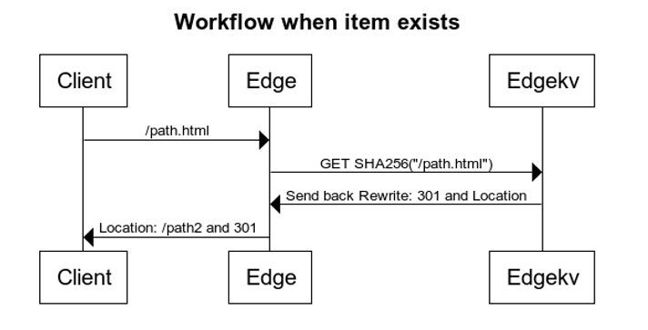

# Akamai EdgeWorker Page Redirector

Two Edgeworker bundles; Edgeworker to populate EdgeKV namespaces and Edgeworker to process page level redirects following EdgeKV item lookup

## Use Case

While re-platforming top tier brand sites to a new framework, we need an efficient and scalable method of redirecting a large library of public indexed pages to their new respective URLs.  In our most recent case, a library of 120K unique source URLs needed redirects defined.

## Solution

Two Akamai Edgeworker bundles were created:

- one bundle to populate EdgeKV namespaces
  - calculate SHA256 hash for item Key
  - write item to edgeKV consisting of a source url hash and the value of the redirects' respective meta data
  - write across multiple shards to support scaling beyond EdgeKV namespace limits
- second bundle to process the client edge request
  - Property manager definition assigns requests for Edgeworker processing
  - Source URL hash is checked in respective EdgeKV namespace for match
  - If match, issue 301 response with Location value from item metadata
  - Cache at Akamai edge for subsequent requests with no Edgeworker invocation

### Workflow Diagram

